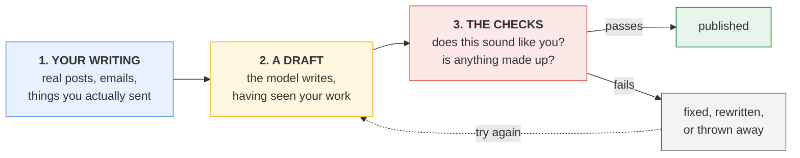
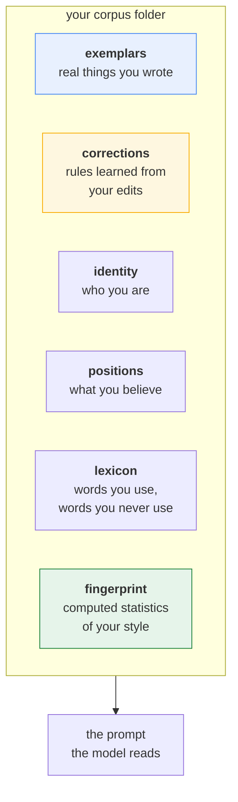
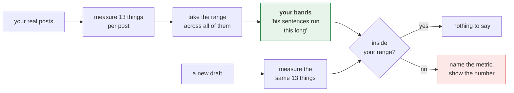
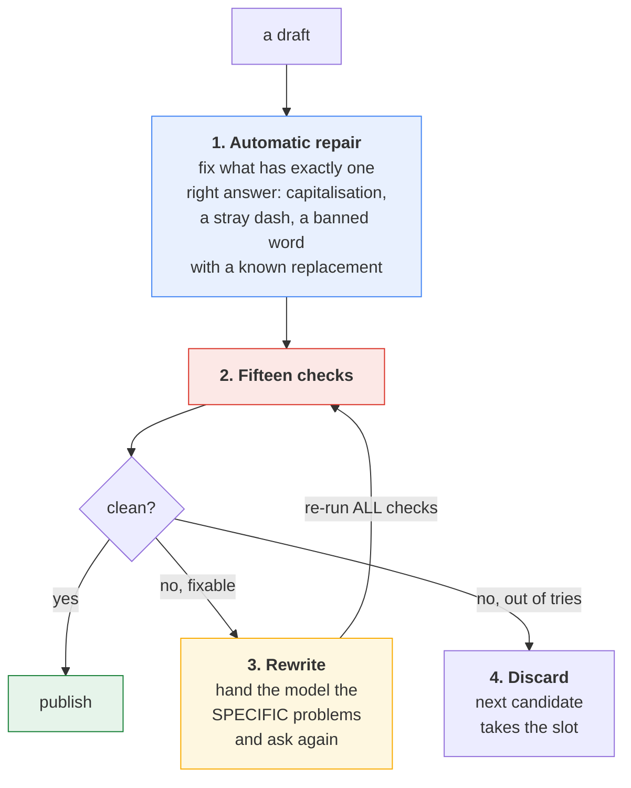
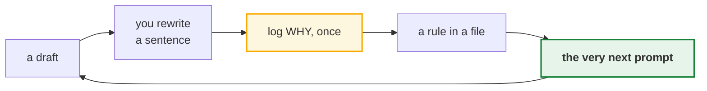
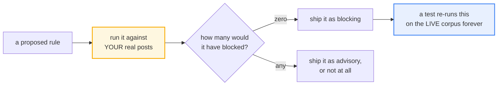

# voice-loop

**Make AI write in your voice, and refuse to publish when it did not.**

A local-first Python toolkit that learns your writing style from work you already
have, checks every draft against it, and learns from every edit you make. No GPU,
no vector database, no cloud account, no fine-tuning. The core imports only the
Python standard library.

```bash
git clone https://github.com/assafkip/voice-loop && cd voice-loop
pip install -e .
voiceloop --help
```

---

## Start here: what this actually is

Imagine you hire a ghostwriter. You would not hand them a list of adjectives and
say "write like me, but punchier." You would hand them a stack of things you
actually wrote, and then you would correct their drafts until they stopped making
the same mistakes.

That is the whole idea. Three parts:



**Step 3 is the part that makes this different.** Anyone can ask a model to
"write like me." The hard engineering is catching it when the model did not,
because a model is confidently wrong in exactly the ways a reader notices.

### The one-sentence version

> It measures how you actually write, then refuses to ship text that does not
> match, and remembers every correction you make so it stops making that mistake.

---

## Why "just prompt harder" does not work

Two common approaches, and the same failure in both:

| Approach | What it does | Why it drifts |
|---|---|---|
| Describe your voice in adjectives | "Write punchy, direct, no fluff" | Adjectives mean different things to a model than to you |
| Fine-tune on your published work | Bakes your style into model weights | Nothing captures what you wanted when you *threw a draft away* |

Both are missing the same signal: **the correction.** The moment you rewrite a
sentence is the moment you say something true about your voice that no amount of
published work contains.

voice-loop keeps that correction in a file you can read, and puts it in the very
next prompt.

---

## How it works, in pictures

### The corpus: what the system reads

Your voice lives in a folder of ordinary files. Not a database, not a model.



**Reading never crashes.** A missing file means less guidance, not a broken run.
A damaged line is skipped and counted, not fatal. This matters because these
files get read by scheduled jobs at six in the morning, and a typo should not
take the whole thing down.

**Writing is the opposite.** Each file has exactly one writer. Going around it is
how the data gets corrupted.

### The fingerprint: measuring a voice

This is the part people assume is magic. It is arithmetic.



The thirteen things are all plainly countable: average sentence length, how much
that length varies, how often you use contractions, how often you hedge
("probably", "arguably"), how many questions you ask mid-piece, how long your
paragraphs run, and so on.

**No model is involved in the measurement.** It is counting words and dividing.

**One rule shapes the whole design:**

> The check must never reject the voice it encodes.

So the acceptable range is your actual minimum to your actual maximum, not a
tidy statistical band. If it used percentiles, it would reject your own real
posts, and a system that rejects your genuine writing gets switched off within a
week.

### The gates: fifteen questions asked of every draft



**Repair runs before any model is asked anything.** That ordering came from a
real failure: three separate times, a model was asked to "fix" correctly-spelled
tool names flagged by a capitalisation rule, and each time it failed against a
rule that generation could never satisfy. Deterministic fixes are free and cannot
spiral.

**A rewrite re-runs every check, unchanged.** A rewrite can satisfy a rule. It can
never weaken one. That property is what makes retrying safe.

The fifteen checks fall into three families:

| Family | Asks | Examples |
|---|---|---|
| **Style** | Does this sound like you? | sentence rhythm, endings that read like marketing, openings a stranger cannot follow |
| **Truth** | Is any of this made up? | claimed jobs checked against a facts file, every number checked against its source |
| **Hygiene** | Is this even a finished post? | template placeholders left in, the model's own instructions echoed back |

The truth checks matter most and are the least obvious. A model is one prompt
away from inventing a statistic that sounds right. A wrong number that reads
naturally is the one thing a reader cannot catch.

### The correction loop: the part that compounds



```bash
voiceloop corrections add \
  --slug lands-a-verdict-not-a-neutral-read \
  --instruction "Take a side out loud and add the consequence." \
  --quote "I disagree with the band-aid. Leadership will point at it later."
```

No retraining. No pipeline run. The next draft has it.

---

## What it costs to run

| | a typical ML pipeline course | voice-loop |
|---|---|---|
| Local tools | Python, Poetry, GNU Make, Docker, cloud CLI | Python |
| Cloud accounts | 7, including model hosting and two databases | none |
| Credentials | 9, including a cloud key, secret, and role identifier | none |
| Steps to first output | 9, including a fine-tune and a quota request | 2 |
| Running cost | roughly $2/hour of GPU while training or serving | $0 |
| Gated model access | request a model by hand | none |

Those numbers come from that project's own install guide. It teaches production
ML well. It is a heavy way to keep your own writing sounding like you. If you
want a full ML pipeline rather than a result, start there.

The core imports only the standard library. The one optional component that loads
a model is documented in [`authorship/`](authorship/) and is off by default.

---

## Design decisions worth stealing

These are the ideas that generalise past this project.

### A rule is tested against you before it ships

Any check based on a word list is first run against **your own writing**, and the
false-positive rate is recorded before the rule is turned on.



The last box is the good part. The test does not check that the rule works. It
re-runs the original measurement against your current writing, **so the day you
write something the rule would block, the rule fails its own test instead of
quietly silencing you.** The check is built to notice when its own premise
expires.

This came from a real week: six word lists blocked their author's genuine
vocabulary in a single session. A check that fires on the person it serves gets
switched off, and a check that is off protects nothing.

### Every number carries how it was measured

Constants in this codebase say where they came from, and admit when they did not
come from anywhere.

One length band carries a flag whose only job is to record that the number was
borrowed from a different channel rather than measured on its own. It would have
been easy to present it as measured. The flag exists so a future reader cannot
believe the number is better grounded than it is.

### Counts are read from the code, never from prose

A comment once said there were nine checks while fifteen were live, for weeks.
Documentation is now written so that any count must be derived from the code
rather than quoted from a sentence.

### A degraded run says so

When an optional input is missing, results that depend on it are labelled NOT
MEASURED rather than printed as ordinary numbers under unchanged headings.

---

## Frequently asked

**Is this fine-tuning?** No, and that is the point. Fine-tuning freezes your
voice into weights at training time. This keeps it in files you can read, edit
and diff, and a correction takes effect on the next prompt rather than the next
training run.

**Does it work with Claude, ChatGPT, Gemini, or local models?** Yes. It sits next
to whatever model you use: it builds the style context you paste or inject into a
prompt, and it scores the draft that comes back. Model-agnostic by construction.

**How much writing do I need?** The reference build ran on about 120 pieces. More
is better; the fingerprint needs enough samples to compute a range.

**Does my private writing leave my machine?** No. There is no cloud component and
no telemetry. Your corpus stays in `corpus/` and ships empty for exactly that
reason.

**Can I use it for a whole team's shared voice?** The mechanism does not care
whose corpus it reads, but every quality claim here was measured against one
writer's corpus. Multi-author corpora are untested; treat it as single-writer
until measured otherwise.

**Do I need to understand the statistics?** No. You need to add real writing and
log a correction when you rewrite something. The measurement is arithmetic the
tool does for you.

---

## What this does not solve

Every check here is a NO check. They prove nothing is wrong. They cannot prove
anything is right.

That is not a hedge, it happened: a draft cleared every gate with zero violations
while using none of the author's real experience. Clean and empty. The fix was
not another gate. It was giving the writer real material to reach for.

**A system that can only say no still needs someone who knows what yes looks
like.**

## License

MIT.
